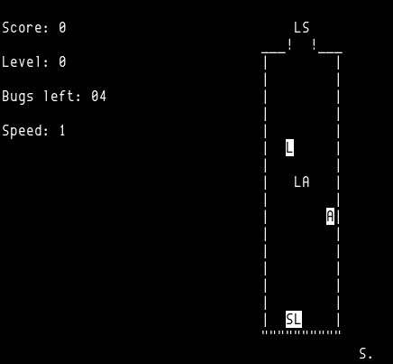

========================
Dr. Mario clone (BUGS I)
========================

The game is written in K&R C with ncurses.

.. contents:: **Contents**
   :local:

History
=======

It seemed to start on 1991-07-10 (v1.3) by and was initially named "BUGS" or  "BUGS I," which is displayed on pause screen.

On 1992-06-12, Scott Noecker released it under "Dr. Mario," same as Nintendo's `Dr. Mario`_, see |README|_.

.. _DR. Mario: https://en.wikipedia.org/wiki/Dr._Mario

.. |README| replace:: ``README``
.. _README: README

On 1992-06-15, Ken Corey made some modification for Linux, see |README.linux|_.

.. |README.linux| replace:: ``README.linux``
.. _README.linux: README.linux

In November, 2015, `Grandpa's Code`_ attempted to continue.

.. _Grandpa's Code: https://bitbucket.org/grandpas/code

Copyright
=========

This game has been placed in Public Domain.
